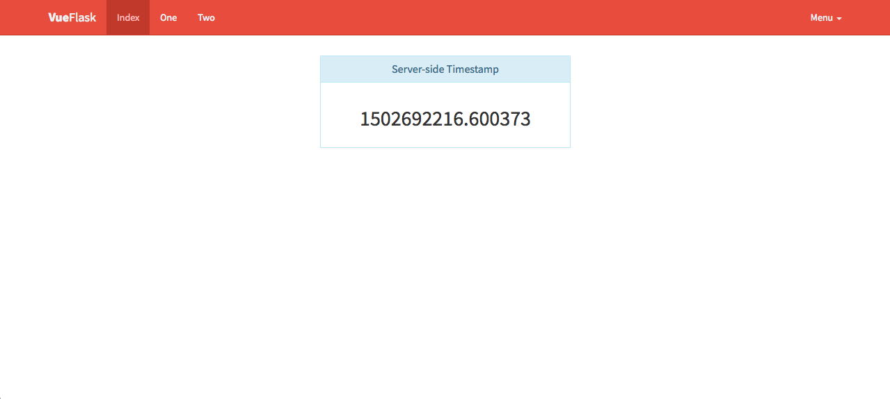

# Vue-Flask

Quick Flask Dashboard using Vue.js, Python, Flask and Flask Bootstrap.

## Features

* Heavy usage of Jinja2 templating and promotes a level of, almost OCD-ish, compartmentalization
* Removed strict requirement of virtual environment and leaves that option to the end-user
* Usage of a fixed top navigation bar in lieu of tabs
* Updated versions of JavaScript components
* Handed over the responsibility of Bootstrap to Flask

## Stack

* Backend
    * Flask
    * Gunicorn

* Frontend
    * VueJS
    * Flask-Bootstrap

## Use

### Requirements

* npm
* python3

#### Setup

    make
    
#### Testing
    
    make check

#### Gunicorn foreground
        
    make run
    
### Structure
    
	.
	├── Makefile
	├── README.md
	├── app
	│   ├── __init__.py
	│   ├── api.py
	│   ├── config.py
	│   ├── static
	│   │   ├── Makefile
	│   │   ├── css
	│   │   │   └── index.css
	│   │   ├── js
	│   │   │   └── app.js
	│   │   └── package.json
	│   ├── templates
	│   │   ├── core
	│   │   │   ├── base.html
	│   │   │   ├── footer
	│   │   │   │   └── scripts.html
	│   │   │   ├── header
	│   │   │   │   ├── links.html
	│   │   │   │   └── scripts.html
	│   │   │   └── navbar.html
	│   │   ├── index.html
	│   │   ├── one.html
	│   │   └── two.html
	│   └── tests
	│       ├── __init__.py
	│       └── test_api.py
	├── docs
	│   └── preview.png
	└── requirements.txt
	
	11 directories, 21 files
